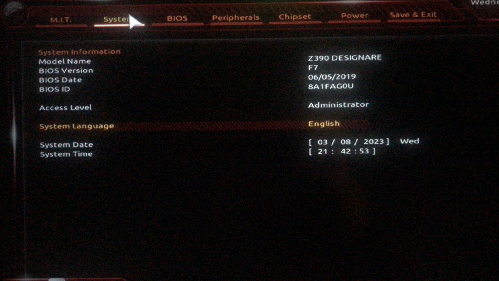

[Português Brasileiro](https://github.com/Gilberto-Mascena/Z390-DESIGNARE/blob/main/README-pt_br.md) | [English](https://github.com/Gilberto-Mascena/Z390-DESIGNARE/blob/main/README.md)

# *EFI OC Gigabyte Z390 DESIGNARE*

---

## *Sistemas operacionais*

  

  

---

_**Minha configuração**_

- _**Placa mãe**_
  - [*Gigabyte Z390 DESIGNARE*](https://www.gigabyte.com/br/Motherboard/Z390-DESIGNARE-rev-10#kf)
- _**Versão de Bios**_
  - *F7*
- _**Fonte**_
  - *CORSAIR - 650W*
- _**CPU**_
  - *Core I7 9700K*
- _**Water Cooler**_
  - *CORSAIR 120*
- _**NVME M.2**_
  - *XPG GAMMIX S41 512GB* 
- _**GPU**_
  - *RADEON RX 580 GAMING X 8GB MSI*
> [!NOTE]
> _Para mais informações sobre GPUs compatíveis com macOS, consulte: [Native amd gpus](https://dortania.github.io/GPU-Buyers-Guide/modern-gpus/amd-gpu.html#native-amd-gpus)_

##
- _**Memória**_
  - *G.SKILL 2x16GB 32GB*
- _**WI-FI / Bluetooth**_
  - *AC9560*
> [!NOTE]
> _Para obter mais informações sobre placas Intel WiFi compatíveis, consulte: [OpenIntelWireless](https://openintelwireless.github.io/itlwm/Compat)_

##
- _**Rede**_
  - *Intel I219-V / I211* 

## _Navegação por tópicos_
- [*O que funciona*](#ancora1)
- [*Capturas de telas*](#ancora2)
- [*Kexts usados, (todas releases)*](#ancora3)
- [*Ferramentas recomendadas*](#ancora4)
- [*Configuração de BIOS Intel*](#ancora5)
- [*Agradecimentos*](#ancora6)
- [*Licença* ](#ancora7)

---

<h2>O que funciona</h2>

- [x] *Audio*
- [x] *Rede (ambas as portas)*
- [x] *WI-FI*
- [x] *Bluetooth*
- [x] *USB*
- [x] *Thunderbolt (Não há suporte [hot swap](https://pt.wikipedia.org/wiki/Hot_swapping), serão feitos testes)*
- [x] *Sleep*

[Top](#ancora)

## Capturas de telas
 

<h2>Versão de BIOS</h2>

<h2>Mapeamento de portas USB</h2>

[Top](#ancora)

<h2>Kexts usados, (todas releases)</h2>

- *[`WhateverGreen.kext`](https://github.com/acidanthera/WhateverGreen)*
- *[`Lilu.kext`](https://github.com/acidanthera/Lilu)*
- *[`VirtualSMC`](https://github.com/acidanthera/VirtualSMC), only: `VirtualSMC.kext`, `SMCProcessor.kext` and `SMCSuperIO.kext`*
- *[`CpuTscSync.kext`](https://github.com/acidanthera/CpuTscSync)*
- *[`AppleALC.kext`](https://github.com/acidanthera/AppleALC)*
- *`USBMap.kext`*
- *[`AirportItlwm.kext`](https://github.com/OpenIntelWireless/itlwm/releases)*
- *[`BlueToolFixup.kext`](https://github.com/acidanthera/BrcmPatchRAM/releases)*
- *[`IntelBlueToothFirmware.kext`](https://github.com/OpenIntelWireless/IntelBluetoothFirmware/releases)*
- *[`IntelBTPatcher.kext`](https://github.com/OpenIntelWireless/IntelBluetoothFirmware/releases)*
- *[`IntelMausi.kext`](https://github.com/acidanthera/IntelMausi)*
- *[`SmallTreeIntel82576.kext`](https://github.com/khronokernel/SmallTree-I211-AT-patch/releases)*

[Top](#ancora)

<h2>Ferramentas recomendadas</h2>

*  Recomendação 1
  * *Use [`GenSMBIOS`](https://github.com/corpnewt/GenSMBIOS), para gerar novos seriais para seu SMBIOS a fim de evitar conflitos com iServices*
* Recomendação 2
  * *Use [`ProperTree`](https://github.com/corpnewt/ProperTree), para editar seu config.plist*     
* Recomendação 3
   * *Use [`USBMap`](https://github.com/corpnewt/USBMap), para mapear suas portas USB, a partir do OC 0.9.3, elas podem ser mapeadas com XHCIPortLimit habilitado em config.plist + [`USBInjectAll`](https://github.com/Sniki/OS-X-USB-Inject-All/releases)*
* Recomendação 4
  * *Extraia seu DSDT do Windows*
  * *Use [`SSDTTime`](https://github.com/corpnewt/SSDTTime), para gerar seus patches SSDT*    
* Recomendação 5
  * *Use [`MaciASL`](https://github.com/acidanthera/MaciASL), para compilar seus patches SSDT no mac*

[Top](#ancora)

<h2>Configuração de BIOS Intel</h2>

- [*OpenCore Install Guide*](https://dortania.github.io/OpenCore-Install-Guide/config.plist/coffee-lake.html#intel-bios-settings)

[Top](#ancora)

## *Agradecimentos*

- [*Acidanthera Team*](https://github.com/acidanthera)
- [*CorpNewt*](https://github.com/corpnewt)
- [*CrisHotpatch*](https://t.me/crishotpatch)
- [*Dortania*](https://dortania.github.io/OpenCore-Install-Guide/config.plist/coffee-lake.html#starting-point)
- [*Dicas do Mateus*](https://www.youtube.com/c/DicasdoMateus)
- [*Gabriel Luchina*](https://www.youtube.com/c/gabrielluchina)
- [*itlwm*](https://github.com/OpenIntelWireless/itlwm)
- [*khronokernel*](https://github.com/khronokernel/SmallTree-I211-AT-patch/releases)
- *E outros*

[Top](#ancora)

## *Licença* 

*The* [*MIT Licença*](LICENSE.md) (*MIT*)

### Gilberto | Dev _2023_ 

[Top](#ancora)

---