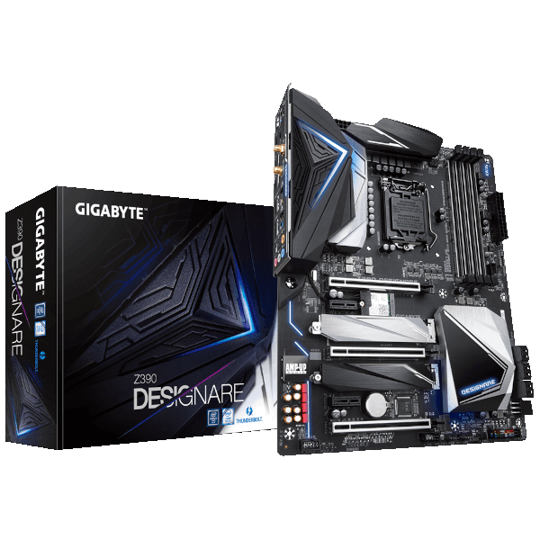

# *EFI OC Z390 DESIGNARE macOS Big Sur*

## *Sistema Operacional*

*macOS* | *Big Sur*
:---:|:---

## *Setup*

*Config* | *Desktop*
:---:|:---
Fonte | CORSAIR - 650W
Placa Mãe | Gigabyte Z390 DESIGNARE
CPU | Core I7 9700K
Water Cooler | CORSAIR 120
NVME M.2 | XPG GAMMIX S41 512GB 
GPU | RX 580 8G MSI
Memória ram | G.SKILL 2x16GB total 32GB

## *O que funciona*

- [x] Áudio.
- [x] LAN (ambas as portas de rede).
- [ ] WI-FI (Não implementado, testes serão feitos).
- [ ] Bluetooth (Não implementado, testes serão feitos).
- [x] USB.
- [x] Thunderbolt (Sem suporte a hot/swap, testes serão feitos via ACPI).
- [x] Sleep.

## *Captura de telas*

## *Agradecimentos*

- [*Acidanthera*](https://github.com/acidanthera)
- [*Dortania*](https://dortania.github.io/OpenCore-Install-Guide/config.plist/coffee-lake.html#starting-point)
- [*CrisHotpatch*](https://t.me/crishotpatch)
- [*Dicas do Mateus*](https://www.youtube.com/c/DicasdoMateus)
- [*Gabriel Luchina*](https://www.youtube.com/c/gabrielluchina)
- [*CorpNewt*](https://github.com/corpnewt)

## *Licença* 

*The* [*MIT License*](https://github.com/Gilberto-Mascena/Hack-Studio/blob/main/LICENSE.md) (*MIT*)

*Copyright :copyright: 2023* 