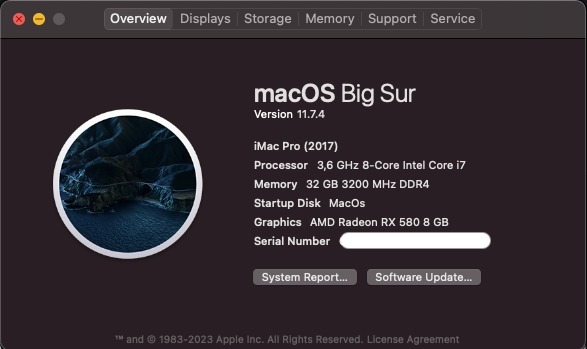
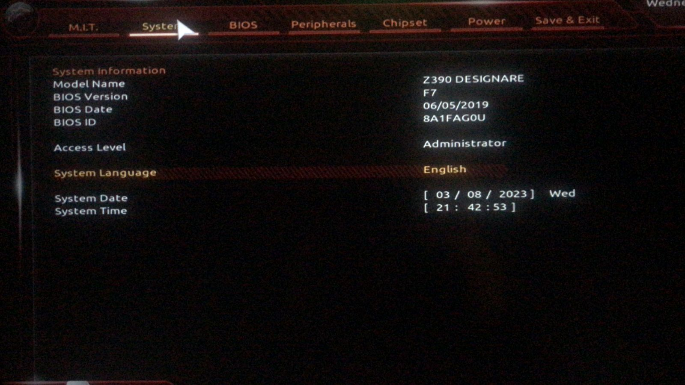
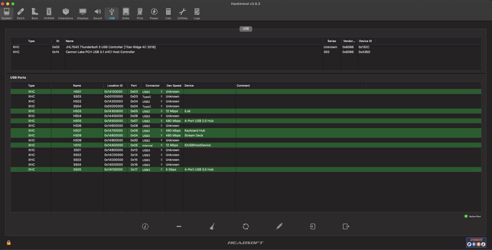

# *EFI OC Z390 DESIGNARE macOS Big Sur*

##

## *Sistema Operacional*

_**macOS** **Big Sur 11.7.4**_

##

## *Setup*

- _**Placa Mãe**_
  - [*Gigabyte Z390 DESIGNARE*](https://www.gigabyte.com/br/Motherboard/Z390-DESIGNARE-rev-10#kf)
- _**Fonte**_
  - *CORSAIR - 650W*
- _**CPU**_
  - *Core I7 9700K*
- _**Water Cooler**_
  - *CORSAIR 120*
- _**NVME M.2**_
  - *XPG GAMMIX S41 512GB* 
- _**GPU**_
  - *RX 580 GAMING X 8G*
- _**Memória ram**_
  - *G.SKILL 2x16GB total 32GB*
- _**Rede**_
  - *Intel I219-V / I211* 
- _**WI-FI / Bluetooth**_
  - *AC9560*
##

## *O que funciona*

- [x] *Áudio.*
- [x] *Rede (ambas as portas de rede).*
- [ ] *WI-FI (Não implementado, testes serão feitos).*
- [ ] *Bluetooth (Não implementado, testes serão feitos).*
- [x] *USB.*
- [x] *Thunderbolt (Sem suporte a hot/swap, testes serão feitos via ACPI).*
- [x] *Sleep.*
##

## *Captura de telas*

##

## *Kexts usadas, (todas versões Releases)*

- *[`WhateverGreen.kext`](https://github.com/acidanthera/WhateverGreen)*
- *[`Lilu.kext`](https://github.com/acidanthera/Lilu)*
- *[`VirtualSMC`](https://github.com/acidanthera/VirtualSMC), somente: `VirtualSMC.kext`, `SMCProcessor.kext` e `SMCSuperIO.kext`*
- *[`CpuTscSync.kext`](https://github.com/acidanthera/CpuTscSync)*
- *[`AppleALC.kext`](https://github.com/acidanthera/AppleALC)*
- *`USBMap.kext`*
- *[`AirportItlwm.kext`](https://github.com/OpenIntelWireless/itlwm/releases)*
- *[`BlueToolFixup.kext`](https://github.com/acidanthera/BrcmPatchRAM/releases)*
- *[`IntelBlueToothFirmware.kext`](https://github.com/OpenIntelWireless/IntelBluetoothFirmware/releases)*
- *[`IntelBTPatcher.kext`](https://github.com/OpenIntelWireless/IntelBluetoothFirmware/releases)*
- *[`IntelMausi.kext`](https://github.com/acidanthera/IntelMausi)*
- *[`SmallTreeIntel82576.kext`](https://github.com/khronokernel/SmallTree-I211-AT-patch/releases)*
##

## *Utilização*

*  Recomendação 1
  * *Use [`GenSMBIOS`](https://github.com/corpnewt/GenSMBIOS), para gerar novos seriais para sua SMBIOS afim de evitar conflitos com iServices.*
* Recomendação 2
  * *Use [`ProperTree`](https://github.com/corpnewt/ProperTree), para editar sua config.plist.*     
* Recomendação 3
   * *Use [`USBMap`](https://github.com/corpnewt/USBMap), para mapear suas portas USB, apartir do OC 0.9.3, pode ser mapeadas com XHCIPortLimit habilitada no config.plist + [`USBInjectAll`](https://github.com/Sniki/OS-X-USB-Inject-All/releases).*
* Recomendação 4
  * *Extrair sua DSDT a partir do windows.*
  * *Use [`SSDTTime`](https://github.com/corpnewt/SSDTTime), para gera seus patches de SSDT.*    
* Recomendação 5
  * *Use [`MaciASL`](https://github.com/acidanthera/MaciASL), para compilar seus patches de SSDT.*
##

## *Agradecimentos*

- [*Acidanthera*](https://github.com/acidanthera)
- [*CorpNewt*](https://github.com/corpnewt)
- [*CrisHotpatch*](https://t.me/crishotpatch)
- [*Dortania*](https://dortania.github.io/OpenCore-Install-Guide/config.plist/coffee-lake.html#starting-point)
- [*Dicas do Mateus*](https://www.youtube.com/c/DicasdoMateus)
- [*Gabriel Luchina*](https://www.youtube.com/c/gabrielluchina)
##

## *Licença* 

*The* [*MIT License*](LICENSE.md) (*MIT*)

*Copyright :copyright: 2023* 
##