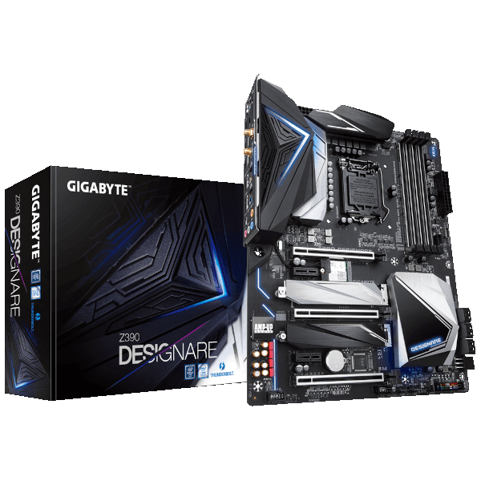
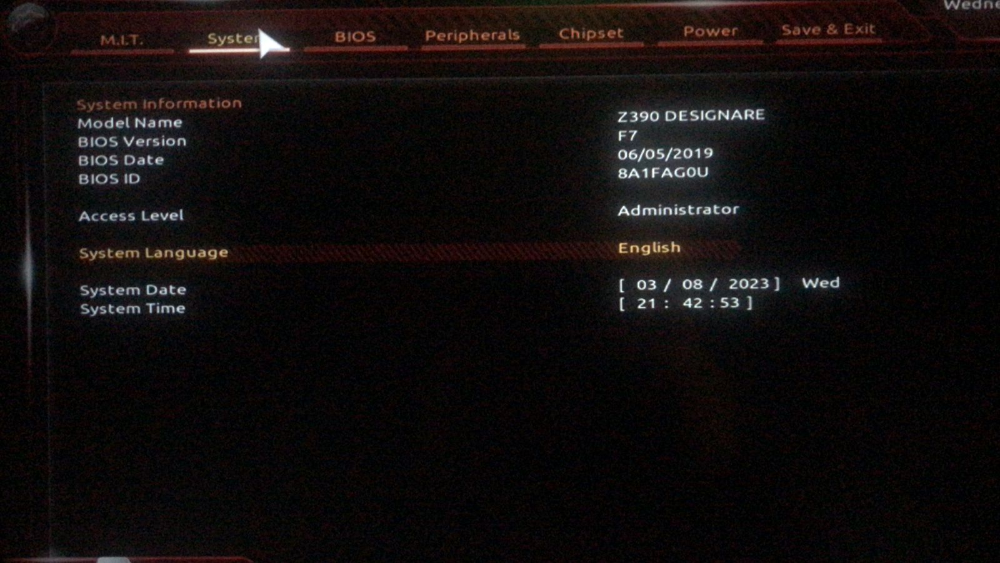
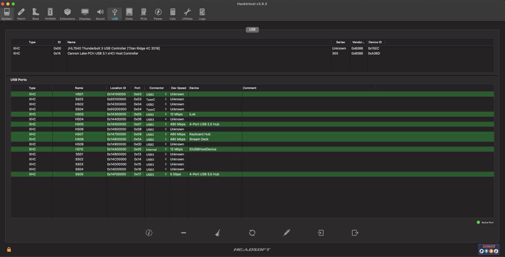

[English](https://github.com/Gilberto-Mascena/Z390-DESIGNARE/blob/main/README.md) | [Português Brasileiro](https://github.com/Gilberto-Mascena/Z390-DESIGNARE/blob/main/README-pt_br.md)

# *EFI OC Gigabyte Z390 DESIGNARE*

---

## *Operating systems*

  

  

---

_**Setup**_

- _**Motherboard**_
  - [*Gigabyte Z390 DESIGNARE*](https://www.gigabyte.com/br/Motherboard/Z390-DESIGNARE-rev-10#kf)
- _**Bios version**_
  - *F7*
- _**Power supply**_
  - *CORSAIR - 650W*
- _**CPU**_
  - *Core I7 9700K*
- _**Water Cooler**_
  - *CORSAIR 120*
- _**NVME M.2**_
  - *XPG GAMMIX S41 512GB* 
- _**GPU**_
  - *RADEON RX 580 GAMING X 8GB MSI*
> [!NOTE]
> *For more information about GPUs compatible with macOS see: [Native amd gpus](https://dortania.github.io/GPU-Buyers-Guide/modern-gpus/amd-gpu.html#native-amd-gpus)*

##
- _**Memory**_
  - *G.SKILL 2x16GB 32GB*
- _**WI-FI / Bluetooth**_
  - *AC9560*
> [!NOTE]
> _For more information on compatible Intel WiFi cards, see: [OpenIntelWireless](https://openintelwireless.github.io/itlwm/Compat)_

##
- _**Network**_
  - *Intel I219-V / I211* 

## _Topic navigation_
- [*What works*](#ancora1)
- [*Screenshot*](#ancora2)
- [*Kexts used, (all Releases)*](#ancora3)
- [*Recommended tools*](#ancora4)
- [*Intel BIOS Settings*](#ancora5)
- [*Thanks*](#ancora6)
- [*License* ](#ancora7)

---

<h2>What works</h2>

- [x] *Sound*
- [x] *Network (both network ports)*
- [x] *WI-FI*
- [x] *Bluetooth*
- [x] *USB*
- [x] *Thunderbolt (No hot/swap support, testing will be done)*
- [x] *Sleep*

[Top](#ancora)

## Screenshots

## *About this mac* 

<h2>BIOS version</h2>

<h2>USB port mapping</h2>

[Top](#ancora)

<h2>Kexts used, (all Releases)</h2>

- *[`WhateverGreen.kext`](https://github.com/acidanthera/WhateverGreen)*
- *[`Lilu.kext`](https://github.com/acidanthera/Lilu)*
- *[`VirtualSMC`](https://github.com/acidanthera/VirtualSMC), only: `VirtualSMC.kext`, `SMCProcessor.kext` and `SMCSuperIO.kext`*
- *[`CpuTscSync.kext`](https://github.com/acidanthera/CpuTscSync)*
- *[`AppleALC.kext`](https://github.com/acidanthera/AppleALC)*
- *`USBMap.kext`*
- *[`AirportItlwm.kext`](https://github.com/OpenIntelWireless/itlwm/releases)*
- *[`BlueToolFixup.kext`](https://github.com/acidanthera/BrcmPatchRAM/releases)*
- *[`IntelBlueToothFirmware.kext`](https://github.com/OpenIntelWireless/IntelBluetoothFirmware/releases)*
- *[`IntelBTPatcher.kext`](https://github.com/OpenIntelWireless/IntelBluetoothFirmware/releases)*
- *[`IntelMausi.kext`](https://github.com/acidanthera/IntelMausi)*
- *[`SmallTreeIntel82576.kext`](https://github.com/khronokernel/SmallTree-I211-AT-patch/releases)*

[Top](#ancora)

<h2>Recommended tools</h2>

*  Recommendation 1
  * *Use [`GenSMBIOS`](https://github.com/corpnewt/GenSMBIOS), to generate new serials for your SMBIOS in order to avoid conflicts with iServices.*
* Recommendation 2
  * *Use [`ProperTree`](https://github.com/corpnewt/ProperTree), to edit your config.plist.*     
* Recommendation 3
   * *Use [`USBMap`](https://github.com/corpnewt/USBMap), to map your USB ports, starting from OC 0.9.3, they can be mapped with XHCIPortLimit enabled in config.plist + [`USBInjectAll`](https://github.com/Sniki/OS-X-USB-Inject-All/releases).*
* Recommendation 4
  * *Extract your DSDT from windows.*
  * *Use [`SSDTTime`](https://github.com/corpnewt/SSDTTime), to generate your SSDT patches.*    
* Recommendation 5
  * *Use [`MaciASL`](https://github.com/acidanthera/MaciASL), to compile your SSDT patches on mac.*

[Top](#ancora)

<h2>Intel BIOS Settings</h2>

- [*OpenCore Install Guide*](https://dortania.github.io/OpenCore-Install-Guide/config.plist/coffee-lake.html#intel-bios-settings)

[Top](#ancora)

## *Thanks*

- [*Acidanthera Team*](https://github.com/acidanthera)
- [*CorpNewt*](https://github.com/corpnewt)
- [*CrisHotpatch*](https://t.me/crishotpatch)
- [*Dortania*](https://dortania.github.io/OpenCore-Install-Guide/config.plist/coffee-lake.html#starting-point)
- [*Dicas do Mateus*](https://www.youtube.com/c/DicasdoMateus)
- [*Gabriel Luchina*](https://www.youtube.com/c/gabrielluchina)
- [*itlwm*](https://github.com/OpenIntelWireless/itlwm)
- [*khronokernel*](https://github.com/khronokernel/SmallTree-I211-AT-patch/releases)
- *And others*

[Top](#ancora)

## *License* 

*The* [*MIT License*](LICENSE.md) (*MIT*)

### Gilberto | Dev _2023_ 

[Top](#ancora)

---